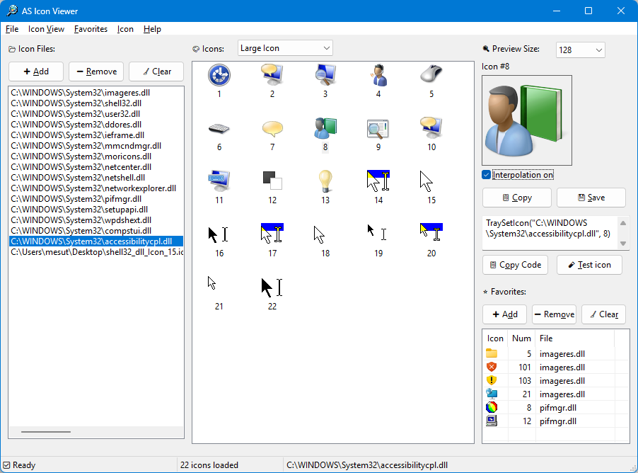

# 🎨 AS Icon Viewer

[](https://www.autohotkey.com/)
[](https://www.microsoft.com/windows)
[](LICENSE)
[](https://github.com/akcansoft/AS-Icon-Viewer/releases)


> A professional-grade icon extraction and management tool for Windows, built with [AutoHotkey v2](https://www.autohotkey.com/)

**AS Icon Viewer** empowers developers and power users to effortlessly view, extract, and manage icons embedded within Windows executables (`.exe`), dynamic-link libraries (`.dll`), and icon files (`.ico`). Perfect for finding icon indices, exporting high-quality assets, and managing your favorite icons.



## 🆕 What's New (v1.3)

- **Direct View Switching:** Replaced the "Switch View" cycle button with a direct DropDownList for instant access to any view mode.
- **Advanced 3-Panel StatusBar:** New native status bar showing operation status, icon counts, and active file paths in separate segments.
- **File Location Explorer:** Added "Open File Location" to the file list context menu to quickly find source files in Windows Explorer.
- **Multi-Select Support:** Enabled multiple file and favorite selection, allowing for bulk removal and more efficient list management.
- **Recursive Layout Consistency:** Realigned all control buttons (Add/Remove/Clear) to be positioned above their respective lists, creating a unified and professional visual flow.
- **Internal Optimization:** Unified file processing logic for both manual selection and Drag & Drop, with improved `.lnk` shortcut resolution.
- **Redesigned Symbols:** Modernized notification system using a centralized Symbol object for consistent visual feedback (info, success, warnings).
- **Refined Menu System:** Reorganized Menu Bar with intuitive access keys (Alt hotkeys) and clearer menu structures.

## 📜 Version History

### v1.2 : 09/02/2026
- **Export Size Selector:** Choose 16–256px sizes for preview and saved icons
- **Better Transparency:** Clipboard copy now uses PNG with alpha
- **Improved Exports:** Higher-quality alpha handling and cleaner ICO output
- **Smarter Save Dialog:** File extension follows the selected file type

### v1.1 : 07/02/2026

### v1.0 : 05/02/2026
- First Release

## ✨ Key Features

### 🔍 Smart Icon Management
- **Intelligent Resource Scanner:** Instantly scan system libraries (`shell32.dll`, `imageres.dll`, etc.) or custom files
- **Drag & Drop Support:** Simply drop any `.dll`, `.exe`, `.ico`, or `.lnk` file onto the interface
- **Dynamic Icon Counting:** Automatically detects and loads all available icons using Windows API
- **Persistent File History:** Your recently accessed files are automatically saved and restored

### 🖼️ Flexible Viewing Options
- **Multiple View Modes:** Toggle between:
  - Large Icon View
  - Small Icon View
  - Large Report View
  - Small Report View
- **Adjustable Preview Size:** 16–256px icon preview with index display
- **Responsive Layout:** Fully resizable interface that adapts to your screen

### ⭐ Favorites System
- **Bookmark Icons:** Save frequently used icons to your favorites list
- **Persistent Storage:** Favorites are automatically saved across sessions
- **Quick Access:** Instantly preview and use your bookmarked icons
- **Bulk Management:** Add, remove, or clear favorites with ease

### 📥 Advanced Export Capabilities
- **Multiple Formats:** Save icons as:
  - `.ico` (Windows Icon)
  - `.png` (Transparent PNG)
  - `.bmp` (Bitmap)
  - `.jpg` (JPEG)
- **Export Size Control:** Save at your chosen size (16–256px)
- **Clipboard Integration:** Copy icon images as PNG with transparency
- **Smart File Naming:** Automatically suggests descriptive filenames based on source and index

### 🛠️ Developer Tools
- **Code Generation:** One-click copy of ready-to-use AutoHotkey code
  ```ahk
  TraySetIcon("C:\WINDOWS\System32\shell32.dll", 23)
  ```
- **Live Icon Testing:** Apply selected icons to the application's window and tray for instant preview
- **Index Display:** Clear labeling of icon numbers for easy reference in code

### 🚀 Performance & Reliability
- **High-Speed Extraction:** Utilizes Windows API (`PrivateExtractIconsW`) for optimal performance
- **Memory Efficient:** Smart ImageList management prevents memory leaks
- **Progress Indicators:** Real-time loading feedback for large icon libraries
- **GDI+ Integration:** High-quality icon rendering and format conversion

## 📋 System Requirements

- **Operating System:** Windows 7, 10, or 11
- **Runtime:** [AutoHotkey v2.0+](https://www.autohotkey.com/) (for `.ahk` script)
- **Compiled Versions:** No dependencies required for `.exe` files

## 📦 Installation

### Option 1: Download Compiled Executable (Recommended)
1. Download the latest release from [Releases](https://github.com/akcansoft/AS-Icon-Viewer/releases)
   - `AS.Icon.Viewer_x64.exe` for 64-bit Windows
   - `AS.Icon.Viewer_x32.exe` for 32-bit Windows
2. Run the executable - no installation required!

### Option 2: Run from Source
1. Install [AutoHotkey v2.0+](https://www.autohotkey.com/)
2. Clone this repository:
   ```bash
   git clone https://github.com/akcansoft/AS-Icon-Viewer.git
   ```
3. Ensure these files are in the same directory:
   - `AS Icon Viewer.ahk`
   - `SaveFileDialog.ahk`
   - `Gdip.ahk`
   - `app_icon.ico`
4. Run `AS Icon Viewer.ahk`

## 🎯 Quick Start Guide

### Loading Icons
1. **Default Libraries:** On first launch, the left panel contains common Windows system icon libraries
2. **Add Custom Files:**
   - Click the **➕ Add** button, or
   - Use **File → Add File** menu, or
   - Drag and drop files directly onto the window
3. **Select a File:** Click any file in the left panel to load its icons

### Working with Icons
- **Preview:** Click any icon to see a high-resolution preview
- **Size:** Use the **Size** dropdown to change preview/export size
- **Copy Code:** Click **📋 Copy Code** to get AutoHotkey code
- **Export:** Click **💾 Save** to export in your preferred format
- **Test:** Click **🧪 Test icon** to preview it as the app icon
- **Add to Favorites:** Click **➕ Add** in the favorites section

### View Modes
- Use the **DropDownList** next to the Icons label or the **Icon View** menu to select:
  1. Small Report View
  2. Large Report View
  3. Small Icon View
  4. Large Icon View

### Context Menus
- **Right-click on icons** for quick access to:
  - Copy Image
  - Save Image
  - Copy Code
  - Test Icon
  - Add to Favorites
  - Refresh List
- **Right-click on file list** for:
  - Open File Location
  - Add/Remove File
  - Clear List

## 🎮 Interface Overview

| Panel | Description |
|-------|-------------|
| **Left Panel** | File list management - Add, remove, or clear icon source files |
| **Middle Panel** | Icon browser with multiple view modes and context menu |
| **Right Panel** | Preview pane with 128x128 display, export options, and favorites |
| **Status Bar** | Real-time feedback on operations and icon counts |
| **Menu Bar** | Full access to all features and settings |

## ⌨️ Keyboard Shortcuts

| Shortcut | Action |
|----------|--------|
| `Left Arrow` | Navigate to previous icon (in Icon View) |
| `Right Arrow` | Navigate to next icon (in Icon View) |
| `Double Click` | Copy icon code to clipboard |
| `Right Click` | Open context menu |

## 🔧 Default Icon Libraries

AS Icon Viewer includes these Windows system libraries by default:

- `imageres.dll` - Modern Windows icons
- `shell32.dll` - Classic shell icons
- `user32.dll` - User interface icons
- `ddores.dll` - Device-specific icons
- `ieframe.dll` - Internet Explorer icons
- `mmcndmgr.dll` - Management console icons
- `moricons.dll` - Additional icons
- `netcenter.dll`, `netshell.dll`, `networkexplorer.dll` - Network icons
- `pifmgr.dll` - Program information icons
- `pnidui.dll` - Network identification icons
- `setupapi.dll` - Setup and installation icons
- `wmploc.dll` - Windows Media Player icons
- `wpdshext.dll` - Portable device icons
- `compstui.dll` - Common UI icons
- `accessibilitycpl.dll` - Accessibility icons

## 🤝 Contributing

Contributions are welcome and appreciated.

If you would like to contribute to this project, please follow these guidelines:

- Fork the repository and create your branch from `main`
- Make sure your code follows the existing style and structure
- Test your changes before submitting
- Clearly describe what your change does and why it is needed

### 🐛 Bug Reports & Feature Requests

- Use GitHub Issues to report bugs or suggest new features
- Please include clear steps to reproduce bugs, if applicable
- Feature requests should explain the use case and expected behavior

### Pull Requests

- Keep pull requests focused and limited to a single purpose
- Make sure your changes do not break existing functionality
- Update documentation if your change affects usage or behavior

### Development Guidelines
- Follow AutoHotkey v2 best practices
- Test on both 32-bit and 64-bit Windows
- Update documentation for new features
- Maintain code comments and formatting

Thank you for taking the time to contribute.

## 📜 License

This project is licensed under the **GNU General Public License v3.0** - see the [LICENSE](LICENSE) file for details.

## 🙏 Acknowledgments

- Built with [AutoHotkey v2](https://www.autohotkey.com/)
- Uses Windows GDI+ for high-quality image processing
- Icon extraction powered by Windows API

## 👨‍💻 Author

**Mesut Akcan**

- 🌐 Blog: [mesutakcan.blogspot.com](https://mesutakcan.blogspot.com)
- 💻 GitHub: [@akcansoft](https://github.com/akcansoft)
- 📺 YouTube: [mesutakcan](https://youtube.com/mesutakcan)
