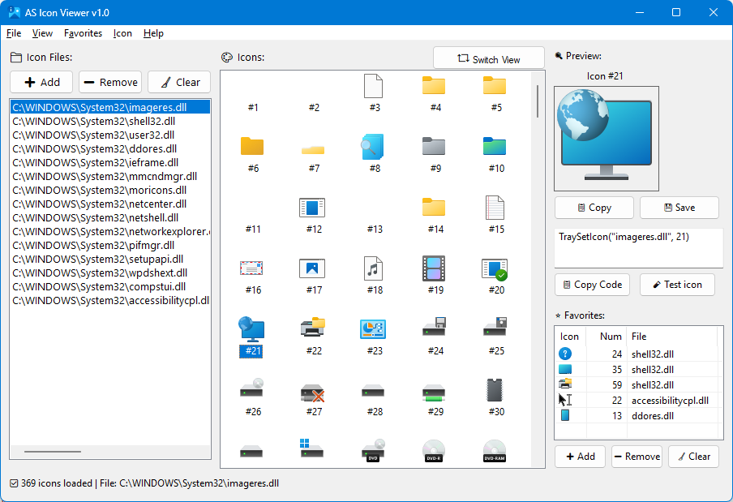

# 🎨 AS Icon Viewer

**AS Icon Viewer** is a professional-grade tool built with **AutoHotkey v2** for viewing, extracting, and managing icons embedded within Windows executables (`.exe`), dynamic-link libraries (`.dll`), and icon files (`.ico`).

It is specifically designed for developers and power users who need to find icon indices quickly or export high-quality assets for their projects.

## ✨ Features

-   **🔍 Smart Resource Browser:** Instantly scan system libraries (like `shell32.dll`, `imageres.dll`) or your custom files.
-   **🖱️ Drag & Drop Support:** Drop any `.dll`, `.exe`, or `.ico` file directly onto the interface to load it.
-   **🖼️ Versatile View Modes:** Toggle between Large Icons, Small Icons, and detailed Report views.
-   **⭐ Favorites Management:** Bookmark frequently used icons and access them across sessions via a persistent favorite list.
-   **📥 Advanced Exporting:**
    * Save icons as **ICO**, **PNG**, **BMP**, or **JPG**.
    * Copy icon images directly to the **Clipboard** for use in design tools.
-   **🛠️ Developer Integration:**
    * **Code Generation:** Copy ready-to-use AHK code (e.g., `TraySetIcon("C:\WINDOWS\System32\shell32.dll", 23)`).
    * **Live Preview:** Instantly apply a selected icon to the application's tray and window to test its appearance.
-   **🚀 High Performance:** Utilizes the Windows API (`PrivateExtractIconsW`) for dynamic, unlimited, and fast icon extraction.

## 🛠️ Requirements

-   [AutoHotkey v2.0+](https://www.autohotkey.com/)
-   Windows OS (7, 10, 11)

## 📦 Installation & Usage

1.  Download or clone this repository to your local machine.
2.  Ensure `AS Icon Viewer.ahk` , `SaveFileDialog.ahk` and `app_icon.ico` are in the same directory.
3.  Launch `AS Icon Viewer.ahk`.

## 🎮 Interface Controls

| Component | Functionality |
| :--- | :--- |
| **Left Panel** | Manage source file list. Add/Remove files or clear the history. |
| **Middle Panel** | Browse icons from the selected source. Use Right-Click for context actions. |
| **Right Panel** | High-res (128x128) preview, index details, and export/favorite buttons. |
| **Status Bar** | Real-time feedback on loading progress and total icon counts. |

## 📂 Project Structure

* `AS Icon Viewer.ahk`: Core application logic and GUI definition.
* `SaveFileDialog.ahk`: A helper library providing a modern Windows "Save As" interface.
* `saved_files.txt`: Automatically persists your recently accessed files.
* `favorites.txt`: Stores your bookmarked icons.

## 🤝 Contributing

Contributions are what make the open-source community such an amazing place to learn, inspire, and create.

1. Fork the Project.
2. Create your Feature Branch (`git checkout -b feature/AmazingFeature`).
3. Commit your Changes (`git commit -m 'Add some AmazingFeature'`).
4. Push to the Branch (`git push origin feature/AmazingFeature`).
5. Open a Pull Request.

## 📜 License

Distributed under the **GNU General Public License v3.0**. See `LICENSE` for more information.

## 👨‍💻 Developer

**Mesut Akcan**
- 🌍 [mesutakcan.blogspot.com](https://mesutakcan.blogspot.com)
- 🐙 [GitHub/akcansoft](https://github.com/akcansoft)
- 📺 [YouTube/mesutakcan](https://youtube.com/mesutakcan)
